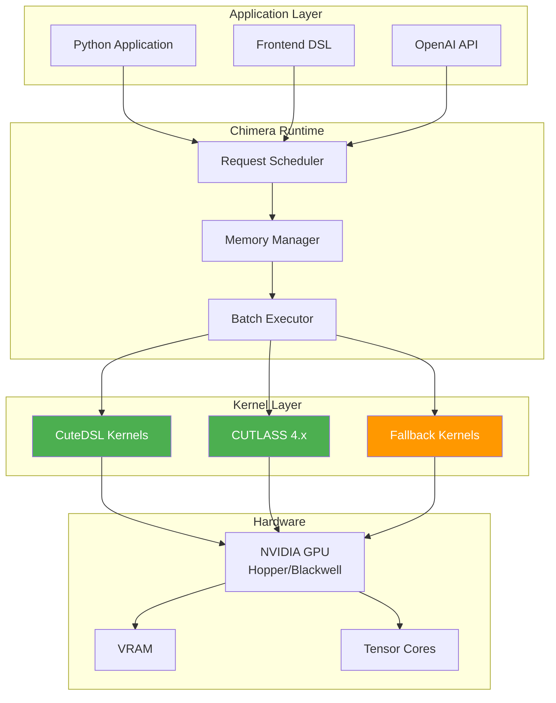
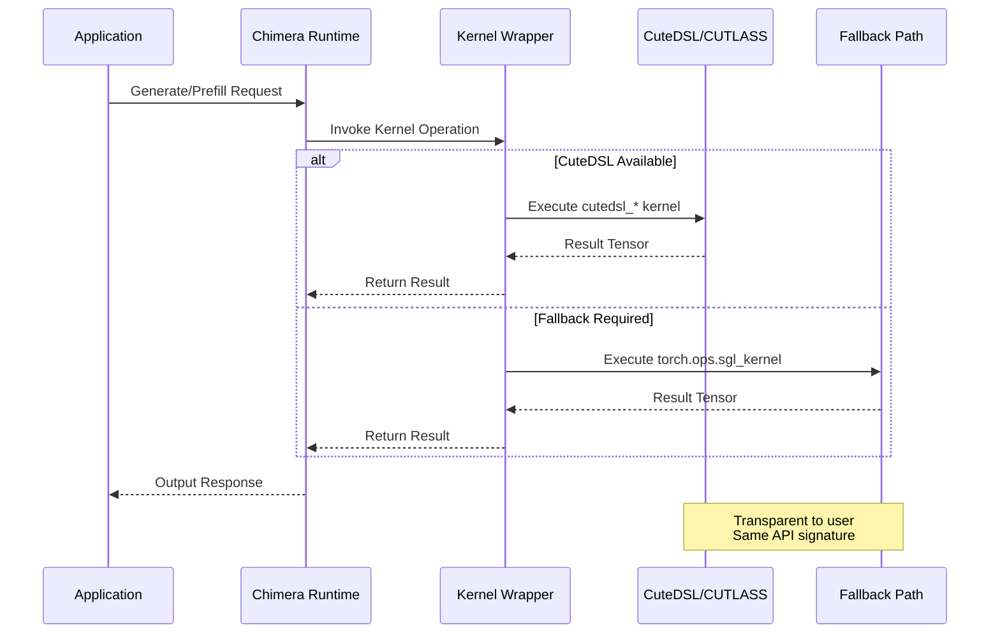
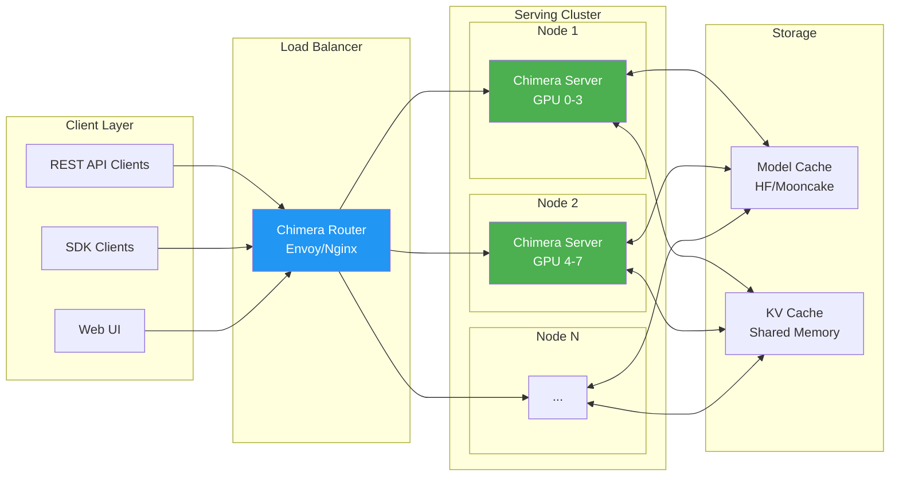
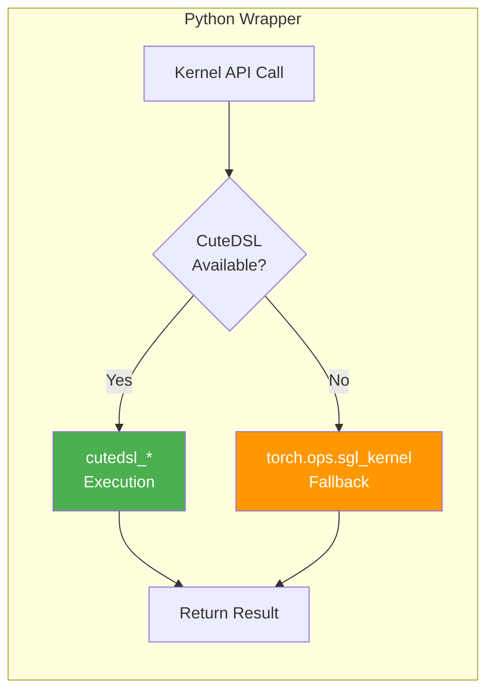
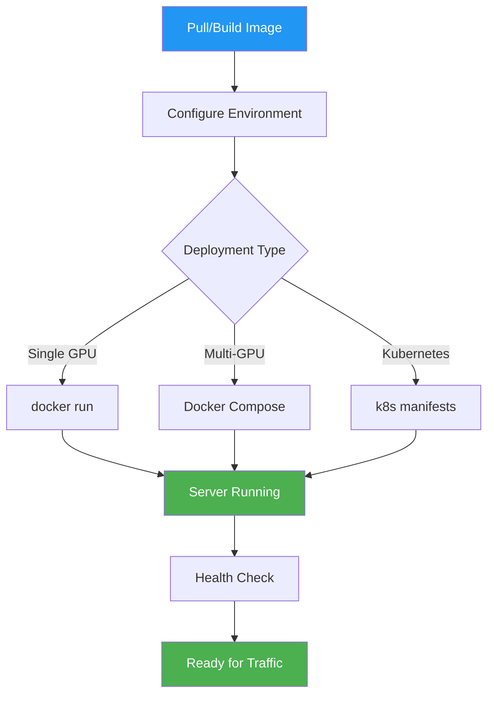
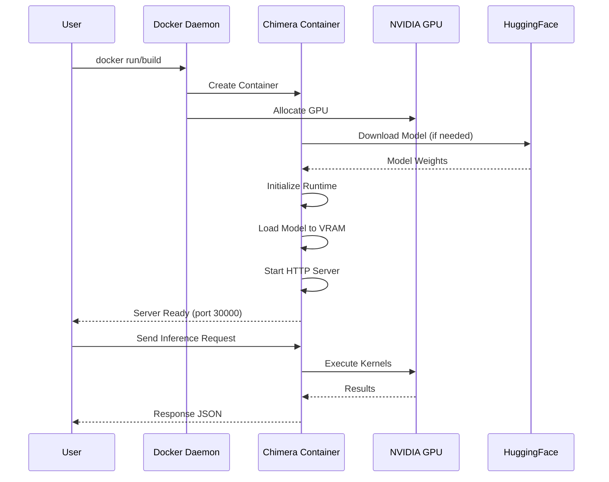

# Chimera

Chimera is a high-performance LLM serving stack spun off from SGLang, with a kernel strategy centered on **CuteDSL** and **CUTLASS 4.x**.

This repository keeps SGLang's serving/runtime strengths while prioritizing newer NVIDIA kernel paths for:
- MLA decode
- FP8 blockwise GEMM
- Expert-specialized grouped GEMM

## Architecture Overview



## Why Chimera

Chimera focuses on one goal: predictable, production-grade throughput on modern NVIDIA architectures by tightening the integration between Python-side launch logic and CUTLASS/CuteDSL kernel implementations.

Key directions:
- CUTLASS 4.x-first kernel development
- CuteDSL launch path integration for new kernels
- Safe runtime fallbacks to existing `torch.ops.sgl_kernel.*` operators
- Incremental migration without breaking caller APIs

## Kernel Execution Flow



## System Deployment Architecture



## Repository Layout

- `python/sglang/` - runtime, server, scheduling, and model integration layers
- `sgl-kernel/` - CUDA/CUTLASS kernels and Python wrappers
- `sgl-model-gateway/` - gateway components and bindings
- `benchmark/` - performance and behavior benchmarks
- `docs/` - project documentation

## Kernel Strategy

Chimera uses a two-path model while kernels are being migrated:



1. **CuteDSL/CUTLASS 4.x path (preferred)**:
   - Python wrapper calls `sgl_kernel.cutedsl_*` entrypoints.
   - Optimized for Hopper/Blackwell architectures
   - Leverages latest CUTLASS 4.x features

2. **Stable ops fallback (always available)**:
   - Wrapper falls back to `torch.ops.sgl_kernel.*` when CuteDSL path is unavailable.
   - Ensures backward compatibility
   - Provides safe migration path

This keeps runtime behavior stable during bring-up and avoids hard failures from partially implemented kernels.

## Build Notes

`sgl-kernel/CMakeLists.txt` resolves Python once and reuses `Python_EXECUTABLE` consistently. This avoids interpreter drift between configuration steps and Python-based discovery logic.

Core dependencies include:
- CUDA Toolkit
- PyTorch
- CUTLASS (fetched in `sgl-kernel/CMakeLists.txt`)
- FlashInfer / Triton / Flash-Attention / DeepGEMM (as configured in `sgl-kernel`)

## Quick Start

1. Create and activate your Python environment.
2. Install project dependencies.
3. Build/install `sgl-kernel` and runtime components.
4. Run tests or benchmark scripts under `sgl-kernel/tests` and `sgl-kernel/benchmark`.

Example workflow:

```bash
# from repo root
pip install -U pip setuptools wheel
pip install -e .

# kernel-focused tests
pytest sgl-kernel/tests/test_fp8_blockwise_gemm.py
pytest sgl-kernel/tests/test_cutlass_mla.py
pytest sgl-kernel/tests/test_es_fp8_blockwise_moe.py
```

## Current Focus Areas

- Complete CuteDSL implementations for:
  - MLA decode
  - FP8 blockwise scaled MM
  - Expert-specialized grouped MM
- Expand architecture-specific tuning for Hopper and Blackwell
- Preserve API compatibility for existing SGLang-integrated call sites

## Compatibility Contract

For kernel wrapper APIs in `sgl-kernel/python/sgl_kernel/`:
- In-place kernels must still return the output tensor when a return value is expected by callers.
- Wrappers should not return `None` for tensor-producing paths.
- Fallback behavior must remain correct under partial kernel migration.

## Contributing

Contributions are welcome, especially in:
- CUTLASS 4.x kernel implementations
- CuteDSL launch and scheduling logic
- correctness/performance test coverage
- architecture-specific tuning and profiling

When submitting changes:
- Include correctness validation (`pytest` for touched kernels)
- Include benchmark deltas when performance behavior changes
- Keep fallback paths intact until new kernel paths are fully production-ready

## Acknowledgements

Chimera is based on SGLang and builds on work across the SGLang and CUDA kernel ecosystem.

## Deployment

### Quick Deploy with Docker

Chimera provides production-ready Docker images for easy deployment:



#### Option 1: Docker Run (Single GPU)

```bash
# Build the image
docker build -t chimera:latest -f docker/Dockerfile.chimera .

# Run with a model
docker run --gpus all -p 30000:30000 \
  -v ~/.cache/huggingface:/root/.cache/huggingface \
  -e HF_TOKEN=your_token \
  chimera:latest \
  --model-path meta-llama/Llama-3.1-8B-Instruct
```

#### Option 2: Docker Compose (Recommended)

```bash
# Start with default configuration
HF_TOKEN=your_token \
  docker compose -f docker/compose.chimera.yaml up -d

# Scale with tensor parallelism (2 GPUs)
TP_SIZE=2 GPU_COUNT=2 \
  docker compose -f docker/compose.chimera.yaml up -d
```

#### Option 3: Kubernetes

```bash
# Deploy single-node service
kubectl apply -f docker/k8s-chimera-service.yaml

# Deploy distributed tensor-parallel service
kubectl apply -f docker/k8s-chimera-distributed-sts.yaml
```

### Container Deployment Flow



### Environment Variables

| Variable | Description | Default |
|----------|-------------|---------|
| `MODEL_PATH` | Model path or HF model ID | `meta-llama/Llama-3.1-8B-Instruct` |
| `PORT` | Server port | `30000` |
| `TP_SIZE` | Tensor parallelism | `1` |
| `MEM_FRACTION` | Memory fraction for model | `0.9` |
| `HF_TOKEN` | HuggingFace API token | - |
| `CUDA_VISIBLE_DEVICES` | GPU device selection | `0` |

### Health Check

The server exposes a health endpoint at `/health`:

```bash
curl http://localhost:30000/health
```

### Monitoring

Chimera exposes Prometheus metrics at `/metrics` for monitoring and observability.

For more deployment options, see:
- [Kubernetes Deployment Guide](docker/k8s-chimera-service.yaml)
- [Docker Compose Configuration](docker/compose.chimera.yaml)
- [Environment Variables Reference](docs/references/environment_variables.md)
