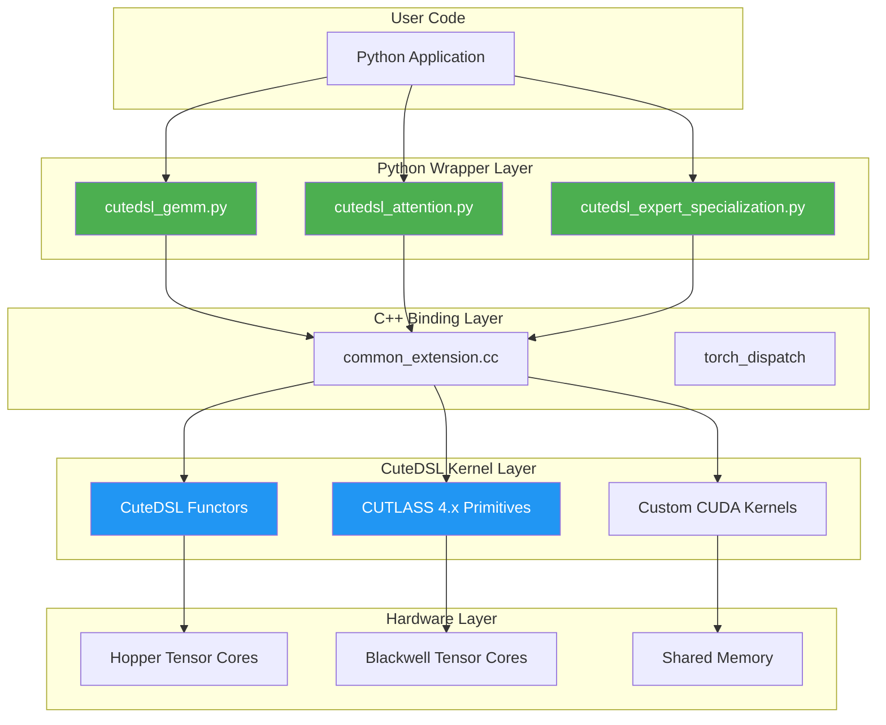
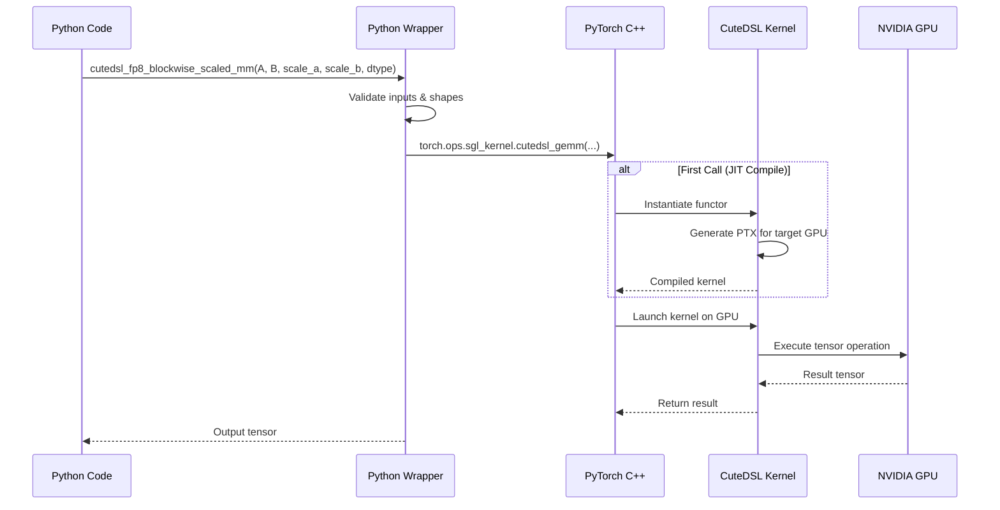
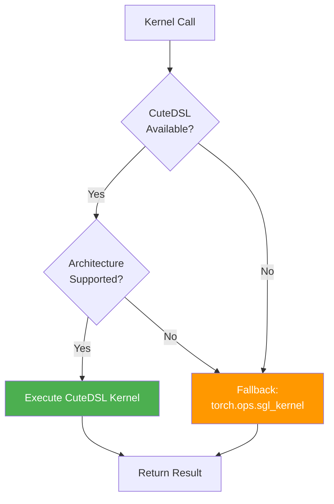

# CuteDSL Integration Guide

## Overview

**CuteDSL** is a domain-specific language embedded in C++/CUDA that provides a high-level abstraction for implementing efficient tensor operations on NVIDIA GPUs. Chimera leverages CuteDSL alongside CUTLASS 4.x to implement next-generation kernels optimized for Hopper and Blackwell architectures.

This guide explains Chimera's CuteDSL integration strategy, kernel architecture, and how to extend or customize kernel implementations.

## Table of Contents

- [What is CuteDSL?](#what-is-cutedsl)
- [Why CuteDSL in Chimera?](#why-cutedsl-in-chimera)
- [Kernel Architecture](#kernel-architecture)
- [CuteDSL Kernel Implementation Pattern](#cutedsl-kernel-implementation-pattern)
- [Available CuteDSL Kernels](#available-cutedsl-kernels)
- [Python Integration Layer](#python-integration-layer)
- [Fallback Mechanism](#fallback-mechanism)
- [Building CuteDSL Kernels](#building-cutedsl-kernels)
- [Performance Tuning](#performance-tuning)
- [Examples](#examples)
- [Troubleshooting](#troubleshooting)

## What is CuteDSL?

CuteDSL (CUDA Universal Tensor Embedded DSL) is a programming model that provides:

- **Composable Primitives**: Building blocks for tensor operations (GEMM, attention, etc.)
- **Layout Abstraction**: Unified view of memory layouts across thread hierarchies
- **Automatic Pipelining**: Built-in support for multi-stage software pipelining
- **Architecture Awareness**: Optimizations tailored for specific GPU architectures
- **Type Safety**: Compile-time checking of tensor shapes and data types

```
┌─────────────────────────────────────────────────────────────┐
│                    CuteDSL Abstraction                       │
├─────────────────────────────────────────────────────────────┤
│  High-Level Kernel Description (Architecture-Agnostic)      │
├─────────────────────────────────────────────────────────────┤
│  Layout Algebra & Thread Mapping                            │
├─────────────────────────────────────────────────────────────┤
│  Automatic Code Generation & Optimization                   │
├─────────────────────────────────────────────────────────────┤
│  Target-Specific PTX Generation (Hopper/Blackwell)          │
└─────────────────────────────────────────────────────────────┘
                              ↓
┌─────────────────────────────────────────────────────────────┐
│                    Hardware Execution                        │
│         Tensor Cores | Shared Memory | Registers            │
└─────────────────────────────────────────────────────────────┘
```

## Why CuteDSL in Chimera?

Chimera adopts CuteDSL for several strategic reasons:

### 1. **Performance on Modern Architectures**

CuteDSL generates kernels that fully utilize:
- **Hopper (H100/H200)**: TMA (Tensor Memory Accelerator), WGMMA (Warp Group Matrix Multiply)
- **Blackwell (B100/B200)**: FP8 microscaling, distributed shared memory

### 2. **Maintainability**

```
Traditional CUDA Kernel: ~500-1000 lines of complex pointer arithmetic
CuteDSL Kernel: ~100-200 lines of declarative tensor operations
```

### 3. **Composability**

CuteDSL kernels can be easily combined:

```python
# Example: Fused operation pipeline
output = cutedsl_fp8_gemm(input, weight)
output = cutedsl_activation(output)
output = cutedsl_quantize(output)
```

### 4. **Future-Proofing**

As NVIDIA releases new architectures, CuteDSL automatically generates optimized code without manual rewrites.

## Kernel Architecture

### Layered Design



### Kernel Execution Flow



## CuteDSL Kernel Implementation Pattern

Chimera follows a consistent pattern for implementing CuteDSL kernels:

### 1. C++ Functor Definition

Located in `sgl-kernel/csrc/<category>/`:

```cpp
// Example: FP8 blockwise GEMM functor
template <typename ElementA, typename ElementB, typename ElementOut>
struct Fp8BlockwiseGemmFunctor {
  using Arguments = GemmArguments;
  
  cudaError_t operator()(
      const Arguments& args,
      cudaStream_t stream
  ) {
    // CuteDSL kernel implementation
    // - Define tensor layouts
    // - Configure thread mapping
    // - Execute GEMM with scaling
  }
};
```

### 2. Torch Binding

In `sgl-kernel/csrc/common_extension.cc`:

```cpp
PYBIND11_MODULE(TORCH_EXTENSION_NAME, m) {
  m.def(
    "cutedsl_fp8_blockwise_scaled_mm",
    &cutedsl_fp8_blockwise_scaled_mm,
    "FP8 blockwise scaled matrix multiply using CuteDSL"
  );
}
```

### 3. Python Wrapper

In `sgl-kernel/python/sgl_kernel/cutedsl_*.py`:

```python
import torch

def cutedsl_fp8_blockwise_scaled_mm(
    mat_a: torch.Tensor,
    mat_b: torch.Tensor,
    scales_a: torch.Tensor,
    scales_b: torch.Tensor,
    out_dtype: torch.dtype,
) -> torch.Tensor:
    """
    Execute FP8 blockwise scaled GEMM using CuteDSL.
    
    Args:
        mat_a: FP8 input tensor A (M, K)
        mat_b: FP8 input tensor B (N, K)
        scales_a: Per-block scales for A
        scales_b: Per-block scales for B
        out_dtype: Output dtype (e.g., torch.float16)
    
    Returns:
        Output tensor of shape (M, N) in out_dtype
    """
    # Validate inputs
    assert mat_a.dtype == torch.float8_e4m3fn
    assert mat_b.dtype == torch.float8_e4m3fn
    
    # Call C++ kernel
    return torch.ops.sgl_kernel.cutedsl_fp8_blockwise_scaled_mm(
        mat_a, mat_b, scales_a, scales_b, out_dtype
    )
```

## Available CuteDSL Kernels

### GEMM Operations

| Kernel | Description | Input Types | Output Type |
|--------|-------------|-------------|-------------|
| `cutedsl_fp8_blockwise_scaled_mm` | FP8 blockwise GEMM with per-block scaling | FP8 + FP8 | FP16/BF16 |
| `cutedsl_fp4_expert_gemm` | FP4 MoE expert GEMM | FP4 + FP4 | FP16 |

### Attention Operations

| Kernel | Description | Input Types | Output Type |
|--------|-------------|-------------|-------------|
| `cutedsl_mla_decode` | Multi-head latent attention decode | FP16/BF16 | FP16/BF16 |

### Expert Specialization

| Kernel | Description | Input Types | Output Type |
|--------|-------------|-------------|-------------|
| `cutedsl_es_fp8_blockwise_scaled_grouped_mm` | FP8 grouped GEMM for MoE | FP8 + FP8 | FP16 |
| `cutedsl_es_sm100_mxfp8_blockscaled_grouped_mm` | SM100 microscaling FP8 | FP8 + FP8 | FP16 |

## Python Integration Layer

### Kernel Wrapper Structure

Each CuteDSL kernel has a Python wrapper that provides:

1. **Input Validation**: Type and shape checking
2. **Fallback Logic**: Graceful degradation to non-CuteDSL paths
3. **Convenience API**: User-friendly interface

Example from `cutedsl_gemm.py`:

```python
def _group_broadcast(t: torch.Tensor, shape: tuple[int, ...]) -> torch.Tensor:
    """Broadcast scale factors to match tensor dimensions."""
    out = t
    for i, s in enumerate(shape):
        if out.shape[i] != s and out.shape[i] != 1:
            if s % out.shape[i] != 0:
                raise ValueError(
                    f"Scale shape {tuple(out.shape)} incompatible with {shape}."
                )
            out = (
                out.unsqueeze(i + 1)
                .expand(*out.shape[: i + 1], s // out.shape[i], *out.shape[i + 1 :])
                .flatten(i, i + 1)
            )
    return out


def cutedsl_fp8_blockwise_scaled_mm(
    mat_a: torch.Tensor,
    mat_b: torch.Tensor,
    scales_a: torch.Tensor,
    scales_b: torch.Tensor,
    out_dtype: torch.dtype,
) -> torch.Tensor:
    # Reference implementation (fallback)
    scale_a = _group_broadcast(scales_a, mat_a.shape)
    scale_b = _group_broadcast(scales_b, mat_b.shape)
    return torch.mm(
        (scale_a * mat_a.to(torch.float32)),
        (scale_b * mat_b.to(torch.float32)),
    ).to(out_dtype)
```

### Integration with SGLang Runtime

CuteDSL kernels integrate seamlessly with SGLang's runtime:

```python
from sglang.srt.layers.quantization.fp8_kernel import (
    cutedsl_fp8_blockwise_scaled_mm as fp8_gemm
)

# Use in model forward pass
output = fp8_gemm(
    hidden_states,  # (batch, seq_len, hidden)
    weight,         # (num_experts, hidden, intermediate)
    scales_a,       # Per-token scales
    scales_b,       # Per-block scales
    torch.float16
)
```

## Fallback Mechanism

Chimera implements a robust fallback strategy:



### Fallback Implementation

```python
def safe_cutedsl_call(kernel_func, *args, **kwargs):
    """Safely call CuteDSL kernel with fallback."""
    try:
        return kernel_func(*args, **kwargs)
    except (ImportError, AttributeError, RuntimeError) as e:
        logger.warning(f"CuteDSL kernel failed, using fallback: {e}")
        return fallback_kernel_impl(*args, **kwargs)
```

## Building CuteDSL Kernels

### Prerequisites

- CUDA Toolkit 12.6+
- CMake 3.31+
- Python 3.10+
- PyTorch 2.9.1
- CUTLASS 4.x (auto-fetched during build)

### Build Process

```bash
# From repository root
cd sgl-kernel

# Configure and build
make build MAX_JOBS=8

# Or with custom CMake args
cmake -B build \
  -DCMAKE_BUILD_TYPE=Release \
  -DSGL_KERNEL_CUDA_FLAGS="-arch=sm_90a" \
  -DCMAKE_INSTALL_PREFIX=install
cmake --build build -j8
```

### Build Configuration

Key CMake options:

| Option | Description | Default |
|--------|-------------|---------|
| `CMAKE_BUILD_TYPE` | Build type (Release/Debug) | Release |
| `MAX_JOBS` | Parallel build jobs | Auto-detect |
| `SGL_KERNEL_CUDA_FLAGS` | Additional NVCC flags | - |
| `SGL_KERNEL_COMPILE_THREADS` | NVCC internal threads | 1 |

### Architecture-Specific Builds

```bash
# Hopper (H100/H200)
export TORCH_CUDA_ARCH_LIST="9.0"
make build

# Blackwell (B100/B200)
export TORCH_CUDA_ARCH_LIST="10.0;10.3"
make build

# Combined (multi-arch wheel)
export TORCH_CUDA_ARCH_LIST="9.0;10.0;10.3"
make build
```

## Performance Tuning

### Kernel Selection

Choose the right kernel for your workload:

```python
# Small batch, low latency
if batch_size < 4:
    use_cutedsl_with_stages(1)  # Minimal pipelining

# Large batch, high throughput
elif batch_size > 32:
    use_cutedsl_with_stages(4)  # Maximum pipelining

# MoE inference
if is_moe_layer:
    use_cutedsl_es_fp8_blockwise()  # Expert-specialized kernel
```

### Memory Optimization

```python
# Optimize shared memory usage
os.environ["SGL_KERNEL_SMEM_SIZE"] = "256KB"

# Configure TMA (Tensor Memory Accelerator)
os.environ["SGL_KERNEL_USE_TMA"] = "1"

# Enable async copy
os.environ["SGL_KERNEL_ASYNC_COPY"] = "1"
```

### Profiling

```bash
# Profile kernel execution
python -m py-spy record -o profile.svg -- \
  python benchmark/kernel_bench.py

# Use Nsight Systems
nsys profile --stats=true \
  python -m sglang.launch_server --model-path ...
```

## Examples

### Example 1: FP8 GEMM

```python
import torch
from sgl_kernel import cutedsl_fp8_blockwise_scaled_mm

# Create FP8 inputs
M, N, K = 128, 256, 512
mat_a = torch.randn(M, K, dtype=torch.float8_e4m3fn).cuda()
mat_b = torch.randn(N, K, dtype=torch.float8_e4m3fn).cuda()

# Create scale factors (per 128x128 block)
BLOCK_M, BLOCK_N = 128, 128
scales_a = torch.randn(
    (M // BLOCK_M, K // BLOCK_M),
    dtype=torch.float32
).cuda()
scales_b = torch.randn(
    (N // BLOCK_N, K // BLOCK_N),
    dtype=torch.float32
).cuda()

# Execute kernel
output = cutedsl_fp8_blockwise_scaled_mm(
    mat_a, mat_b, scales_a, scales_b, torch.float16
)

print(f"Output shape: {output.shape}")  # (M, N)
print(f"Output dtype: {output.dtype}")  # torch.float16
```

### Example 2: MLA Decode

```python
import torch
from sgl_kernel import cutedsl_mla_decode

# Multi-head latent attention decode
batch_size = 8
num_heads = 32
head_dim = 128
seq_len = 1024

q_nope = torch.randn(batch_size, num_heads, head_dim, dtype=torch.float16).cuda()
q_pe = torch.randn(batch_size, num_heads, head_dim, dtype=torch.float16).cuda()
kv_cache = torch.randn(
    batch_size * seq_len, 2 * head_dim, dtype=torch.float16
).cuda()
seq_lens = torch.tensor([seq_len] * batch_size, dtype=torch.int32).cuda()
page_table = torch.arange(batch_size, dtype=torch.int32).cuda()
workspace = torch.empty(1024 * 1024, dtype=torch.uint8).cuda()
out = torch.zeros(batch_size, num_heads, head_dim, dtype=torch.float16).cuda()

# Execute MLA decode
cutedsl_mla_decode(
    out=out,
    q_nope=q_nope,
    q_pe=q_pe,
    kv_c_and_k_pe_cache=kv_cache,
    seq_lens=seq_lens,
    page_table=page_table,
    workspace=workspace,
    sm_scale=1.0 / (head_dim ** 0.5),
    num_kv_splits=1,
)
```

### Example 3: MoE Expert Specialization

```python
import torch
from sgl_kernel import cutedsl_es_fp8_blockwise_scaled_grouped_mm

# MoE configuration
num_experts = 8
batch_tokens = 1024
hidden_dim = 4096
intermediate_dim = 11008

# Expert assignments (top-2 gating)
expert_offsets = torch.tensor(
    [0, 128, 256, 384, 512, 640, 768, 896], dtype=torch.int32
).cuda()
problem_sizes = torch.tensor(
    [[128, intermediate_dim, hidden_dim]] * num_experts, dtype=torch.int32
).cuda()

# Expert weights (FP8)
a = torch.randn(
    batch_tokens, hidden_dim, dtype=torch.float8_e4m3fn
).cuda()
b = torch.randn(
    num_experts, hidden_dim, intermediate_dim, dtype=torch.float8_e4m3fn
).cuda()

# Scale factors
scales_a = torch.randn(batch_tokens, dtype=torch.float32).cuda()
scales_b = torch.randn(
    num_experts, intermediate_dim, dtype=torch.float32
).cuda()

# Strides
stride_a = torch.tensor([a.stride(0), a.stride(1)], dtype=torch.int64).cuda()
stride_b = torch.tensor([b.stride(0), b.stride(1), b.stride(2)], dtype=torch.int64).cuda()
stride_d = torch.tensor([hidden_dim], dtype=torch.int64).cuda()

# Workspace
workspace = torch.empty(16 * 1024 * 1024, dtype=torch.uint8).cuda()

# Output buffer
output = torch.zeros(
    batch_tokens, intermediate_dim, dtype=torch.float16
).cuda()

# Execute grouped GEMM
cutedsl_es_fp8_blockwise_scaled_grouped_mm(
    output=output,
    a=a,
    b=b,
    scales_a=scales_a,
    scales_b=scales_b,
    stride_a=stride_a,
    stride_b=stride_b,
    stride_d=stride_d,
    problem_sizes=problem_sizes,
    expert_offsets=expert_offsets,
    workspace=workspace,
)
```

## Troubleshooting

### Common Issues

#### 1. Import Error: `No module named 'sgl_kernel.cutedsl_*'`

**Cause**: CuteDSL kernels not built or installed.

**Solution**:
```bash
# Rebuild sgl-kernel
cd sgl-kernel
pip install -e .

# Verify installation
python -c "import sgl_kernel; print(dir(sgl_kernel))"
```

#### 2. CUDA Error: `invalid device function`

**Cause**: Kernel compiled for wrong architecture.

**Solution**:
```bash
# Set correct architecture
export TORCH_CUDA_ARCH_LIST="9.0;10.0"
pip install -e . --no-build-isolation
```

#### 3. Performance Degradation

**Cause**: Fallback to non-CuteDSL path.

**Solution**:
```python
# Check if CuteDSL is being used
import logging
logging.basicConfig(level=logging.DEBUG)

# Force CuteDSL path
os.environ["SGL_KERNEL_FORCE_CUTEDSL"] = "1"
```

#### 4. Out of Shared Memory

**Cause**: Kernel requires more shared memory than available.

**Solution**:
```bash
# Reduce block size or pipeline stages
export SGL_KERNEL_SMEM_SIZE="128KB"
```

### Debug Mode

Enable verbose logging:

```python
import os
os.environ["SGL_KERNEL_DEBUG"] = "1"
os.environ["SGL_KERNEL_LOG_LEVEL"] = "DEBUG"

# Now run your code
```

### Performance Validation

```python
import torch
from sgl_kernel import cutedsl_fp8_blockwise_scaled_mm

# Warmup
for _ in range(10):
    _ = cutedsl_fp8_blockwise_scaled_mm(...)

# Benchmark
start = torch.cuda.Event(enable_timing=True)
end = torch.cuda.Event(enable_timing=True)

start.record()
for _ in range(100):
    _ = cutedsl_fp8_blockwise_scaled_mm(...)
end.record()
torch.cuda.synchronize()

elapsed_ms = start.elapsed_time(end) / 100
print(f"Average time: {elapsed_ms:.3f} ms")
print(f"TFLOPS: {2 * M * N * K / (elapsed_ms * 1e-3) / 1e12:.2f}")
```

## Additional Resources

- [CUTLASS Documentation](https://github.com/NVIDIA/cutlass)
- [CuteDSL Tutorial](https://github.com/NVIDIA/cutlass/tree/main/media/docs/cutedsl)
- [Chimera Kernel Tests](../sgl-kernel/tests/)
- [Benchmark Scripts](../sgl-kernel/benchmark/)

## Contributing

We welcome contributions to expand CuteDSL kernel coverage:

1. **New Kernels**: Implement missing operations using CuteDSL
2. **Optimizations**: Improve existing kernel performance
3. **Tests**: Add correctness and performance tests
4. **Documentation**: Improve examples and guides

See [CONTRIBUTING.md](../CONTRIBUTING.md) for details.

---

**Last Updated**: March 29, 2026
**Version**: Chimera v1.0
