# CuteDSL Visual Guide

## Understanding Chimera's Kernel Strategy Through Diagrams

This companion document provides visual explanations of how CuteDSL works within Chimera.

## 1. Kernel Abstraction Layers

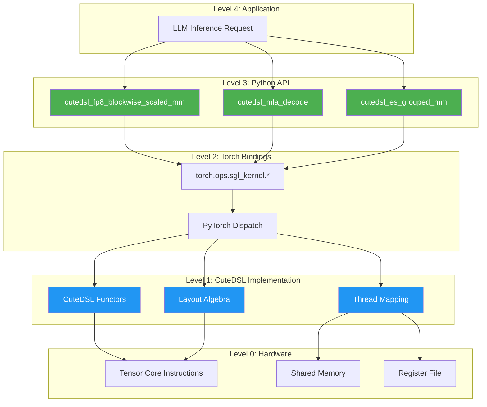

## 2. Data Flow: From Python to GPU

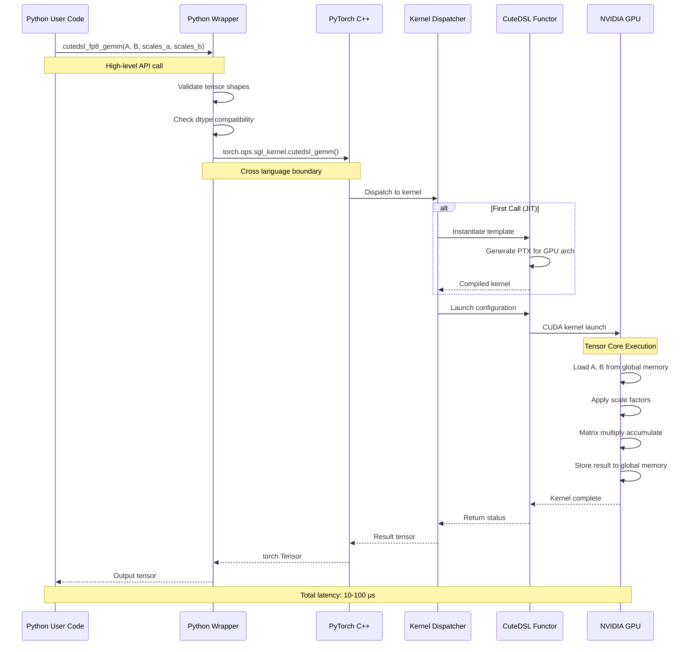

## 3. CuteDSL vs Traditional CUDA

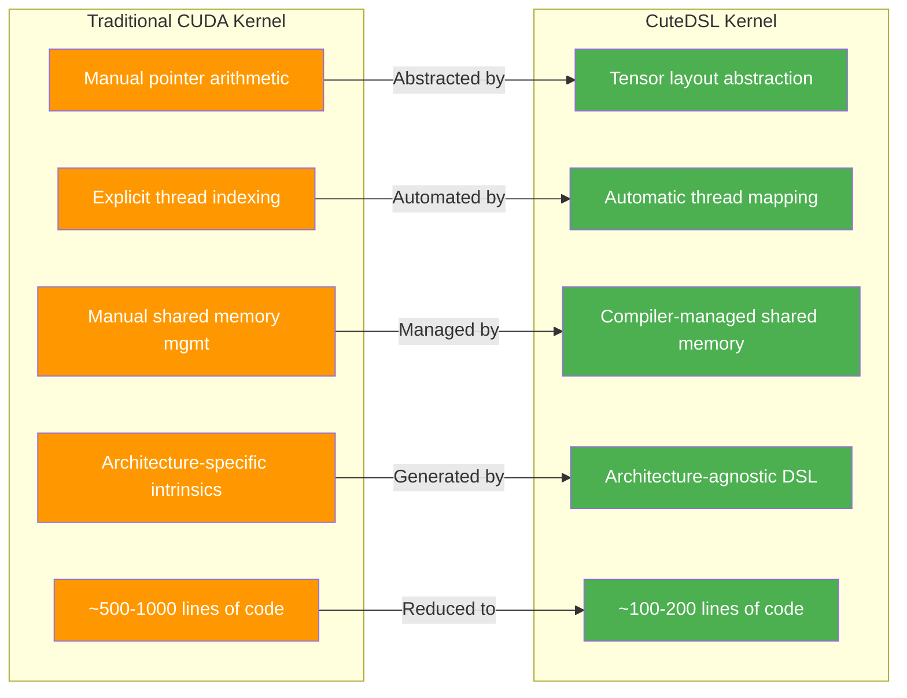

## 4. Kernel Fallback Strategy

```mermaid
flowchart TD
    Start[Kernel Request] --> Check1{CuteDSL<br/>Installed?}
    Check1 -->|No| Fallback1[Use torch.ops.sgl_kernel]
    Check1 -->|Yes| Check2{GPU Architecture<br/>Supported?}
    
    Check2 -->|No<br/>(e.g., Ampere)| Fallback1
    Check2 -->|Yes<br/>(e.g., Hopper)| Check3{Input Types<br/>Valid?}
    
    Check3 -->|No| Error[Raise Error]
    Check3 -->|Yes| Check4{Memory<br/>Available?}
    
    Check4 -->|No| Fallback2[Use Smaller Tiles<br/>or Fallback]
    Check4 -->|Yes| Execute[Execute CuteDSL Kernel]
    
    Execute --> Success{Success?}
    Success -->|Yes| Return[Return Result]
    Success -->|No| Retry[Retry with Fallback]
    
    Fallback1 --> Return
    Fallback2 --> Return
    Retry --> Return
    
    style Execute fill:#4CAF50,color:#fff
    style Return fill:#4CAF50,color:#fff
    style Fallback1 fill:#FF9800,color:#fff
    style Fallback2 fill:#FF9800,color:#fff
    style Error fill:#F44336,color:#fff
```

## 5. FP8 Blockwise GEMM Architecture

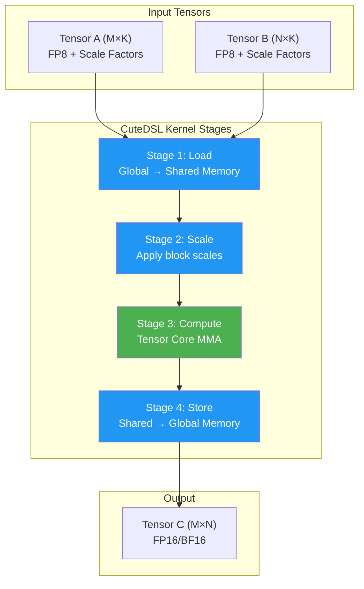

## 6. Multi-Stage Pipelining

```mermaid
gantt
    title CuteDSL Kernel Pipelining (4 stages)
    dateFormat X
    axisFormat %L
    
    section Stage 0
    Load A0,B0 :a0, 0, 10
    Compute C0 :crit, a1, 10, 15
    
    section Stage 1
    Load A1,B1 :a2, 10, 20
    Compute C1 :crit, a3, 25, 40
    
    section Stage 2
    Load A2,B2 :a4, 20, 30
    Compute C2 :crit, a5, 40, 55
    
    section Stage 3
    Load A3,B3 :a6, 30, 40
    Compute C3 :crit, a7, 55, 70
    
    section Memory
    Async Copy :m1, 0, 70
```

## 7. Thread Hierarchy Mapping

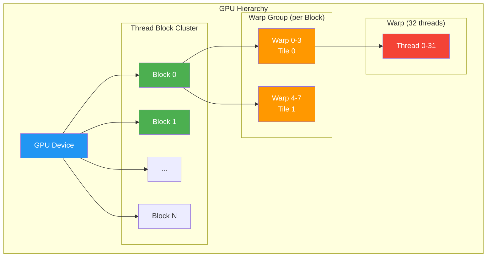

## 8. Memory Movement in CuteDSL

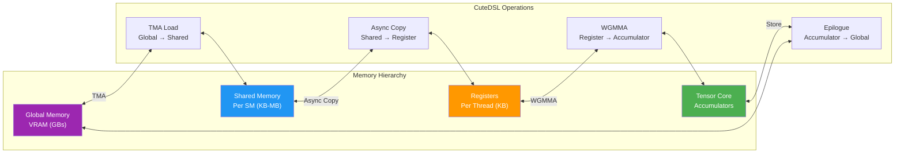

## 9. MoE Expert Specialization Flow

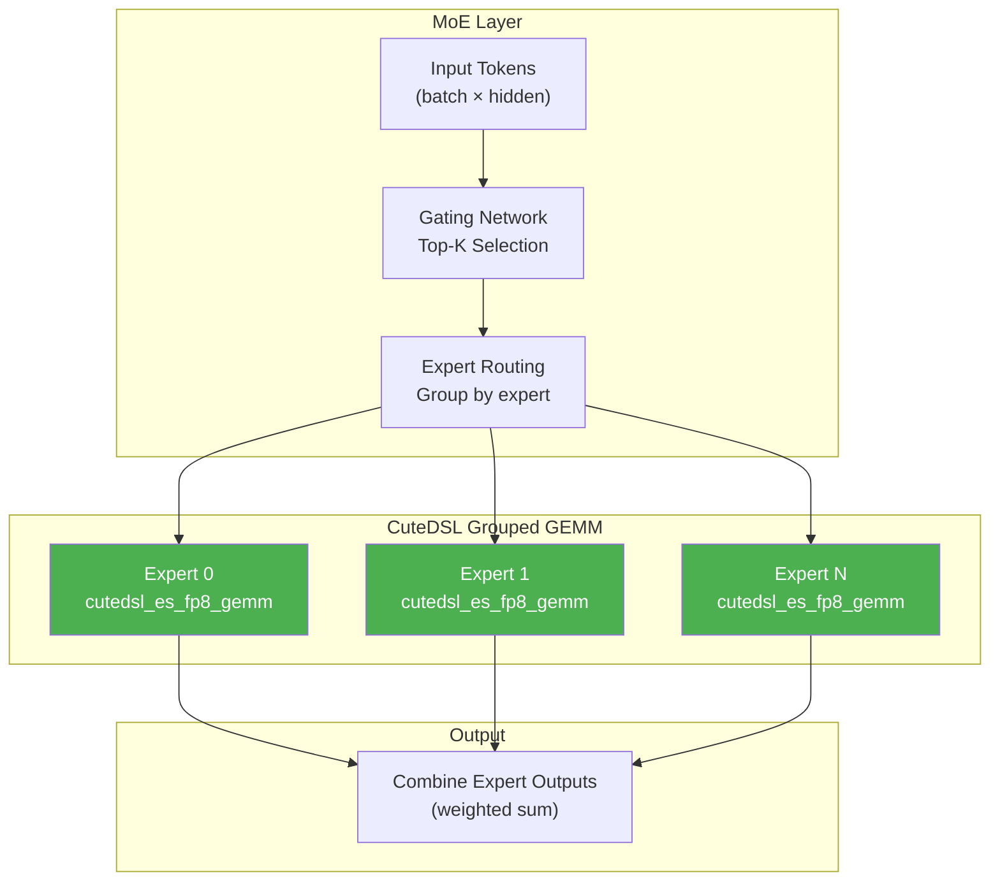

## 10. Performance Comparison

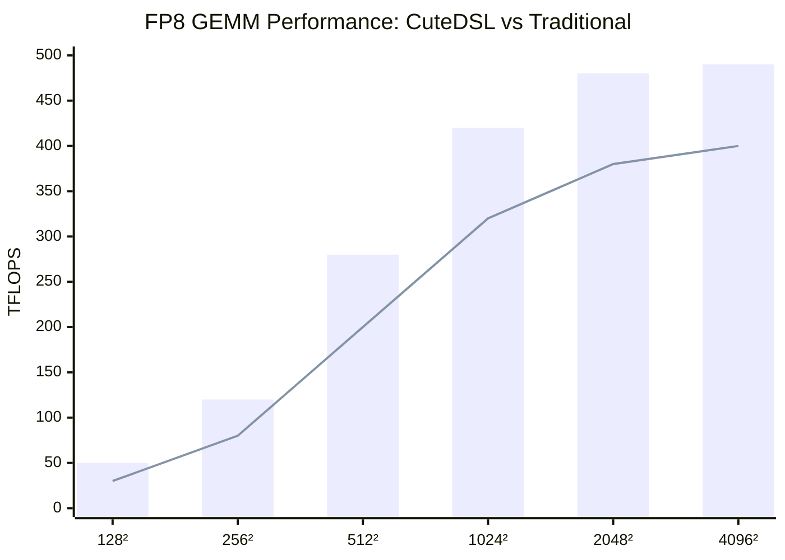

**Legend**:
- **Bar**: CuteDSL (CUTLASS 4.x)
- **Line**: Traditional CUDA kernels

## 11. Build and Deployment Pipeline

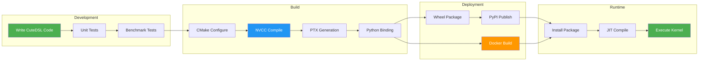

## 12. Kernel Selection Decision Tree

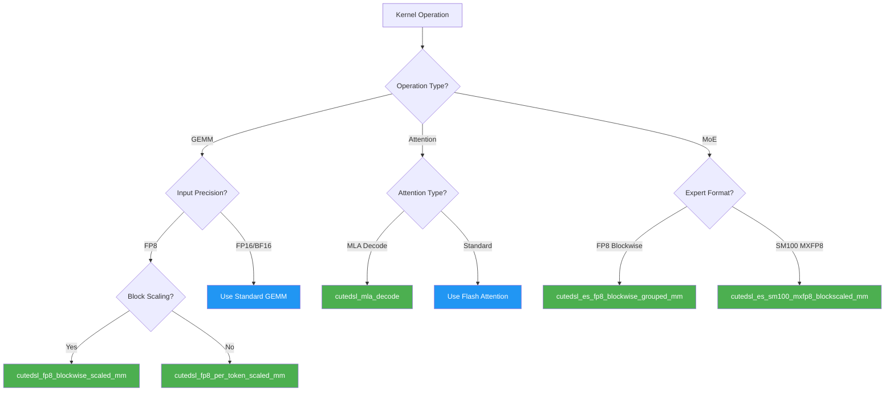

## 13. Error Handling Flow

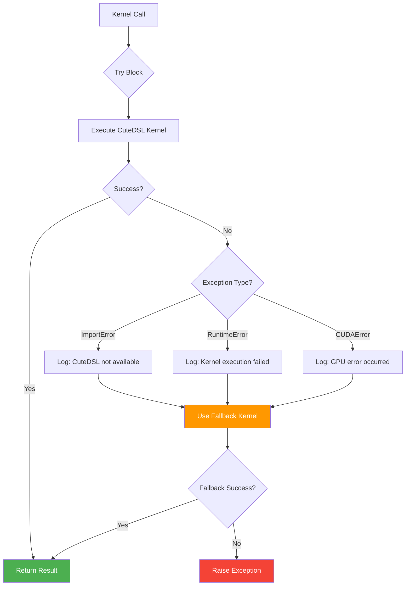

## 14. Complete Inference Pipeline

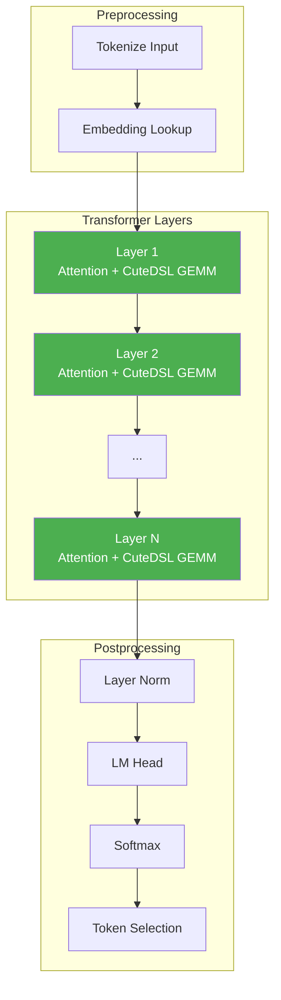

---

**Last Updated**: March 29, 2026
**Version**: Chimera v1.0
