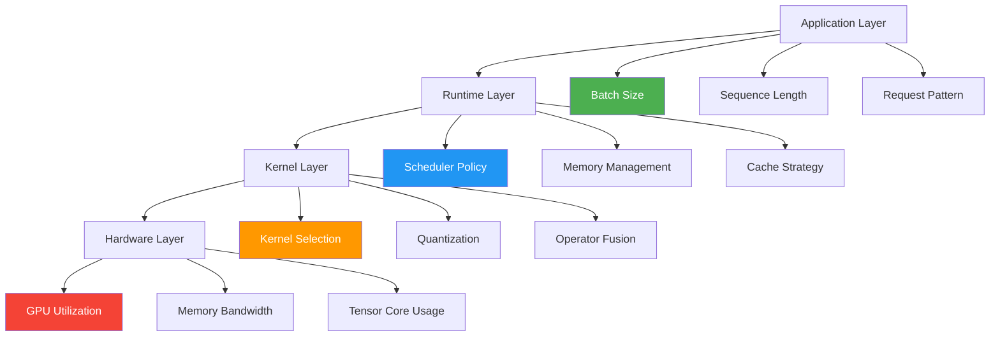

# Chimera Performance Tuning Guide

## Overview

This guide provides comprehensive performance tuning recommendations for Chimera LLM serving. Learn how to optimize throughput, reduce latency, and maximize GPU utilization.

## Table of Contents

- [Performance Fundamentals](#performance-fundamentals)
- [GPU Optimization](#gpu-optimization)
- [Memory Management](#memory-management)
- [Kernel-Level Tuning](#kernel-level-tuning)
- [Batching Strategies](#batching-strategies)
- [Quantization Optimization](#quantization-optimization)
- [Multi-GPU Scaling](#multi-gpu-scaling)
- [Profiling and Benchmarking](#profiling-and-benchmarking)
- [Performance Checklist](#performance-checklist)

---

## Performance Fundamentals

### Key Metrics

| Metric | Description | Target |
|--------|-------------|--------|
| **Throughput** | Tokens/sec or requests/sec | Maximize |
| **Latency** | Time to first token (TTFT) | < 100ms |
| **Latency** | Time per output token (TPOT) | < 50ms |
| **GPU Utilization** | SM and Tensor Core usage | > 80% |
| **Memory Efficiency** | VRAM utilization | 85-95% |

### Performance Hierarchy



---

## GPU Optimization

### 1. GPU Selection

Choose the right GPU for your workload:

| Workload | Recommended GPU | Reason |
|----------|----------------|--------|
| **Large Models (70B+)** | H100/H200 (80GB) | High VRAM, FP8 support |
| **Medium Models (7-70B)** | A100 (40/80GB) | Balanced performance |
| **Small Models (<7B)** | L40S, A10 | Cost-effective |
| **Inference-Only** | L4, T4 | Low power, good efficiency |
| **Blackwell Available** | B100, B200 | Best FP8 performance |

### 2. GPU Clock and Power

```bash
# Set GPU to performance mode
sudo nvidia-smi -pm 1

# Lock to maximum clock (example for H100)
sudo nvidia-smi -lgc 1980

# Set power limit (watts)
sudo nvidia-smi -pl 700

# Verify settings
nvidia-smi -q -d CLOCK,POWER
```

### 3. Multi-Instance GPU (MIG)

For A100/H100, consider MIG for isolation:

```bash
# Enable MIG mode
sudo nvidia-smi -i 0 -mig 1

# Create instances
sudo nvidia-smi mig -i 0 -cgi 19 -ci 14

# List instances
nvidia-smi mig -lgi
```

---

## Memory Management

### 1. Memory Fraction Tuning

Adjust memory allocation for model vs KV cache:

```python
# In server configuration
--mem-fraction-static 0.90  # 90% for model weights
--max-running-requests 100  # Limit concurrent requests
```

**Recommendations:**
- **70B+ models**: 0.85-0.90 (more for model)
- **7-70B models**: 0.80-0.85 (balanced)
- **<7B models**: 0.75-0.80 (more for KV cache)

### 2. KV Cache Optimization

```bash
# Enable radix attention cache
--enable-radix-cache

# Set cache size
--kv-cache-size-gb 40

# Use FP8 KV cache (Hopper+)
--kv-cache-dtype fp8_e4m3
```

### 3. Paged Attention

Enable paged attention for better memory utilization:

```python
# Configuration
--page-size 16  # Tokens per page
--enable-paged-attention
```

**Benefits:**
- Reduces memory fragmentation
- Enables dynamic sequence lengths
- Improves multi-request efficiency

---

## Kernel-Level Tuning

### 1. Kernel Selection

Chimera automatically selects optimal kernels, but you can influence selection:

```python
# Force CuteDSL kernels (Hopper/Blackwell)
os.environ["SGL_KERNEL_FORCE_CUTEDSL"] = "1"

# Enable FlashInfer attention
os.environ["SGL_KERNEL_USE_FLASHINFER"] = "1"

# Enable CUTLASS GEMM
os.environ["SGL_KERNEL_USE_CUTLASS"] = "1"
```

### 2. Tensor Core Optimization

```python
# Enable TF32 for better performance (slight precision loss)
torch.backends.cuda.matmul.allow_tf32 = True
torch.backends.cudnn.allow_tf32 = True

# Enable benchmark mode for optimal kernel selection
torch.backends.cudnn.benchmark = True
```

### 3. Operator Fusion

Enable fused operators where available:

```bash
# Enable fused MoE kernel
--enable-fused-moe

# Enable fused activation
--enable-fused-activation

# Enable fused normalization
--enable-fused-norm
```

### 4. CuteDSL Kernel Tuning

For custom kernel configurations:

```python
# Set shared memory size
os.environ["SGL_KERNEL_SMEM_SIZE"] = "256KB"

# Enable TMA (Tensor Memory Accelerator)
os.environ["SGL_KERNEL_USE_TMA"] = "1"

# Configure pipeline stages
os.environ["SGL_KERNEL_PIPELINE_STAGES"] = "4"

# Enable async memory copy
os.environ["SGL_KERNEL_ASYNC_COPY"] = "1"
```

---

## Batching Strategies

### 1. Dynamic Batching

```bash
# Enable dynamic batching
--enable-batch-regulation

# Set max batch size
--max-batch-size 256

# Set batch regulation threshold
--batch-regulation-threshold 0.8
```

### 2. Continuous Batching (In-flight Batching)

```bash
# Enable continuous batching
--enable-continuous-batching

# Set scheduling policy
--schedule-policy "shortest-job-first"
```

**Benefits:**
- Reduces tail latency
- Improves GPU utilization
- Better for mixed workloads

### 3. Request Prioritization

```python
# Priority queue configuration
--enable-priority-schedule

# Priority levels (1-10)
# Lower number = higher priority
```

---

## Quantization Optimization

### 1. FP8 Quantization (Recommended for Hopper/Blackwell)

```bash
# Enable FP8 for weights
--quantization fp8

# Enable FP8 for KV cache
--kv-cache-dtype fp8_e4m3

# Enable FP8 for attention
--attention-dtype fp8_e4m3
```

**Performance Gains:**
- **Throughput**: 2-3x improvement
- **Memory**: 50% reduction
- **Latency**: 30-50% reduction

### 2. INT8 Quantization

```bash
# Enable INT8 for weights
--quantization int8

# Enable INT8 for activation
--activation-dtype int8
```

### 3. AWQ (Activation-aware Weight Quantization)

```bash
# Enable AWQ 4-bit quantization
--quantization awq
--awq-group-size 128
```

### 4. Quantization Comparison

| Method | Precision | Memory | Speed | Quality Loss |
|--------|-----------|--------|-------|--------------|
| **FP16** | 16-bit | 1.0x | 1.0x | None |
| **FP8** | 8-bit | 0.5x | 2-3x | Minimal |
| **INT8** | 8-bit | 0.5x | 1.5-2x | Low |
| **INT4/AWQ** | 4-bit | 0.25x | 2-4x | Moderate |

---

## Multi-GPU Scaling

### 1. Tensor Parallelism

```bash
# Enable tensor parallelism
--tp-size 4  # Number of GPUs

# Set communication backend
--nccl-backend "nvls"  # For NVLink
```

**Scaling Efficiency:**

| GPUs | Efficiency | Best For |
|------|------------|----------|
| 2 | 90-95% | 13-34B models |
| 4 | 85-90% | 34-70B models |
| 8 | 80-85% | 70B+ models |

### 2. Pipeline Parallelism

```bash
# Enable pipeline parallelism
--pp-size 2

# Set number of micro-batches
--num-micro-batches 8
```

### 3. Expert Parallelism (MoE)

```bash
# Enable expert parallelism for MoE
--ep-size 8

# Set MoE configuration
--moe-num-experts 8
--moe-top-k 2
```

### 4. Hybrid Parallelism

```bash
# Combine tensor and pipeline parallelism
--tp-size 4
--pp-size 2
# Total: 8 GPUs
```

---

## Profiling and Benchmarking

### 1. Built-in Profiler

```bash
# Enable profiling
--profile-dir /tmp/profile
--profile-memory-usage

# Run profiling
python -m sglang.launch_server \
  --model-path meta-llama/Llama-3.1-8B-Instruct \
  --profile-dir /tmp/profile

# Analyze results
python -m pytorch_profiler.analyze /tmp/profile
```

### 2. Nsight Systems

```bash
# Profile with Nsight Systems
nsys profile --stats=true \
  -t cuda,nvtx,osrt \
  -o /tmp/profile.qdrep \
  python -m sglang.launch_server \
  --model-path meta-llama/Llama-3.1-8B-Instruct
```

### 3. Py-Spy

```bash
# Profile Python stack traces
py-spy record \
  -o /tmp/profile.svg \
  -- python -m sglang.launch_server \
  --model-path meta-llama/Llama-3.1-8B-Instruct
```

### 4. Benchmark Scripts

```bash
# Throughput benchmark
python benchmark/throughput.py \
  --model meta-llama/Llama-3.1-8B-Instruct \
  --num-prompts 1000 \
  --request-rate 10

# Latency benchmark
python benchmark/latency.py \
  --model meta-llama/Llama-3.1-8B-Instruct \
  --input-len 512 \
  --output-len 256

# Multi-turn benchmark
python benchmark/multi_turn.py \
  --model meta-llama/Llama-3.1-8B-Instruct \
  --num-conversations 100
```

### 5. Key Profiling Metrics

```python
# Example profiling output
{
    "throughput": 1250,        # tokens/sec
    "avg_latency": 45.2,       # ms
    "p50_latency": 38.5,       # ms
    "p99_latency": 125.8,      # ms
    "gpu_util": 87.5,          # %
    "gpu_memory": 75.2,        # GB
    "kv_cache_util": 68.3,     # %
}
```

---

## Performance Checklist

### Pre-Deployment

- [ ] Select appropriate GPU for model size
- [ ] Set GPU to performance mode
- [ ] Install latest CUDA and drivers
- [ ] Configure NCCL for multi-GPU
- [ ] Enable huge pages for memory

### Runtime Configuration

- [ ] Set optimal `--mem-fraction-static`
- [ ] Enable appropriate quantization (FP8/INT8)
- [ ] Configure batch size limits
- [ ] Enable continuous batching
- [ ] Set KV cache dtype (FP8 if available)

### Kernel Optimization

- [ ] Verify CuteDSL kernels are active
- [ ] Enable FlashInfer attention
- [ ] Enable operator fusion
- [ ] Configure pipeline stages
- [ ] Enable async memory operations

### Monitoring

- [ ] Set up Prometheus metrics
- [ ] Configure logging level
- [ ] Enable health checks
- [ ] Set up alerting for GPU errors
- [ ] Monitor memory usage trends

### Validation

- [ ] Run throughput benchmark
- [ ] Run latency benchmark
- [ ] Verify GPU utilization > 80%
- [ ] Check for kernel fallbacks
- [ ] Validate output quality

---

## Quick Tuning Recipes

### Recipe 1: Maximum Throughput

```bash
python -m sglang.launch_server \
  --model-path meta-llama/Llama-3.1-70B-Instruct \
  --tp-size 8 \
  --mem-fraction-static 0.90 \
  --quantization fp8 \
  --enable-continuous-batching \
  --max-batch-size 512 \
  --schedule-policy "shortest-job-first"
```

### Recipe 2: Low Latency

```bash
python -m sglang.launch_server \
  --model-path meta-llama/Llama-3.1-8B-Instruct \
  --mem-fraction-static 0.85 \
  --quantization fp8 \
  --max-running-requests 32 \
  --enable-radix-cache \
  --kv-cache-dtype fp8_e4m3
```

### Recipe 3: Memory Efficient

```bash
python -m sglang.launch_server \
  --model-path meta-llama/Llama-3.1-70B-Instruct \
  --tp-size 4 \
  --quantization awq \
  --awq-group-size 128 \
  --mem-fraction-static 0.95 \
  --enable-paged-attention
```

### Recipe 4: Multi-Model Serving

```bash
python -m sglang.launch_server \
  --model-path meta-llama/Llama-3.1-8B-Instruct \
  --mem-fraction-static 0.75 \
  --max-running-requests 256 \
  --enable-radix-cache \
  --schedule-policy "round-robin"
```

---

## Common Performance Issues

### Issue 1: Low GPU Utilization

**Symptoms:** GPU utilization < 50%

**Solutions:**
- Increase batch size
- Enable continuous batching
- Check for CPU bottlenecks
- Verify kernel selection (no fallbacks)

### Issue 2: High Tail Latency

**Symptoms:** P99 latency >> P50 latency

**Solutions:**
- Enable request prioritization
- Reduce max batch size
- Use shortest-job-first scheduling
- Limit concurrent requests

### Issue 3: Out of Memory

**Symptoms:** CUDA OOM errors

**Solutions:**
- Reduce `--mem-fraction-static`
- Enable paged attention
- Use quantization (FP8/INT8)
- Reduce max batch size
- Enable KV cache quantization

### Issue 4: Poor Multi-GPU Scaling

**Symptoms:** Efficiency < 70% with multiple GPUs

**Solutions:**
- Check NVLink connectivity
- Verify NCCL configuration
- Increase tensor parallelism
- Use appropriate model parallelism strategy

---

## Advanced Tuning

### 1. Custom Kernel Configuration

```python
# Create custom kernel config
import sgl_kernel

config = {
    "gemm": {
        "use_cutedsl": True,
        "pipeline_stages": 4,
        "async_copy": True,
    },
    "attention": {
        "use_flashinfer": True,
        "use_fp8": True,
    },
    "moe": {
        "use_fused_kernel": True,
        "expert_parallel": True,
    }
}

sgl_kernel.configure(config)
```

### 2. Dynamic Reconfiguration

```python
# Adjust batch size dynamically
server.set_max_batch_size(256)

# Adjust memory fraction
server.set_mem_fraction(0.85)

# Enable/disable features
server.enable_feature("continuous_batching")
```

### 3. Workload-Specific Tuning

```python
# For chat workloads (short sequences)
config_chat = {
    "max_batch_size": 512,
    "schedule_policy": "shortest-job-first",
    "enable_radix_cache": True,
}

# For document QA (long sequences)
config_qa = {
    "max_batch_size": 64,
    "schedule_policy": "fcfs",
    "enable_radix_cache": False,
    "page_size": 32,
}
```

---

## Resources

- [NVIDIA Performance Guide](https://docs.nvidia.com/deeplearning/performance/)
- [CUTLASS Optimization Guide](https://github.com/NVIDIA/cutlass)
- [PyTorch Performance Tips](https://pytorch.org/tutorials/recipes/recipes/tuning_guide.html)
- [Chimera Kernel Documentation](cutedsl_integration.md)

---

**Last Updated**: March 29, 2026
**Version**: Chimera v1.0
