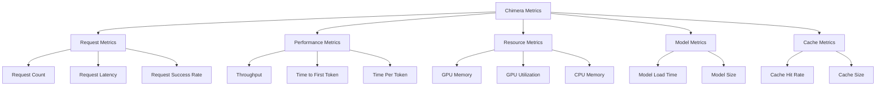
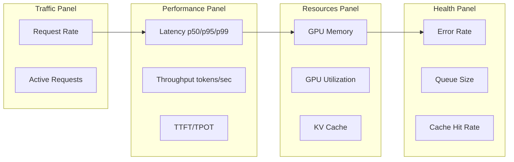
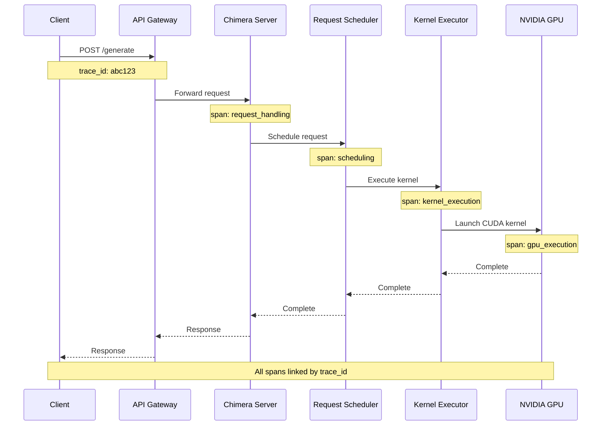

# Chimera Monitoring & Observability Guide

## Overview

This guide covers monitoring, observability, and operational best practices for Chimera deployments in production environments.

## Table of Contents

- [Metrics Overview](#metrics-overview)
- [Prometheus Integration](#prometheus-integration)
- [Grafana Dashboards](#grafana-dashboards)
- [Logging Configuration](#logging-configuration)
- [Distributed Tracing](#distributed-tracing)
- [Alerting Setup](#alerting-setup)
- [Health Checks](#health-checks)
- [Performance Monitoring](#performance-monitoring)
- [Operational Runbooks](#operational-runbooks)

---

## Metrics Overview

Chimera exposes comprehensive metrics for monitoring system health and performance.

### Metric Categories



### Available Metrics

| Metric Name | Type | Description | Labels |
|-------------|------|-------------|--------|
| `chimera_request_count` | Counter | Total requests processed | `type`, `status`, `model` |
| `chimera_request_latency_seconds` | Histogram | Request latency distribution | `type`, `percentile` |
| `chimera_tokens_total` | Counter | Total tokens processed | `type` (prompt/completion) |
| `chimera_throughput_tokens_per_sec` | Gauge | Current token throughput | - |
| `chimera_time_to_first_token_seconds` | Histogram | TTFT distribution | `model` |
| `chimera_time_per_token_seconds` | Histogram | TPOT distribution | `model` |
| `chimera_gpu_memory_usage_bytes` | Gauge | GPU memory used | `gpu_id` |
| `chimera_gpu_utilization_percent` | Gauge | GPU utilization percentage | `gpu_id` |
| `chimera_kv_cache_usage_percent` | Gauge | KV cache utilization | - |
| `chimera_cache_hit_rate` | Gauge | Prefix cache hit rate | - |
| `chimera_batch_size` | Histogram | Batch size distribution | - |
| `chimera_queue_size` | Gauge | Current request queue size | - |
| `chimera_active_adapters` | Gauge | Number of loaded LoRA adapters | - |
| `chimera_model_info` | Gauge | Model metadata | `model`, `version` |

---

## Prometheus Integration

### Exposing Metrics

Chimera exposes Prometheus metrics at `/metrics` endpoint:

```bash
# Start server with metrics enabled
python -m sglang.launch_server \
  --model-path meta-llama/Llama-3.1-8B-Instruct \
  --port 30000 \
  --enable-metrics

# Access metrics
curl http://localhost:30000/metrics
```

**Sample Output:**
```
# HELP chimera_request_count Total number of requests
# TYPE chimera_request_count counter
chimera_request_count{type="generate",status="success",model="llama-3.1-8b"} 1523

# HELP chimera_request_latency_seconds Request latency in seconds
# TYPE chimera_request_latency histogram
chimera_request_latency_seconds_bucket{le="0.1"} 450
chimera_request_latency_seconds_bucket{le="0.5"} 1200
chimera_request_latency_seconds_bucket{le="1.0"} 1450
chimera_request_latency_seconds_bucket{le="+Inf"} 1523
chimera_request_latency_seconds_sum 892.5
chimera_request_latency_seconds_count 1523

# HELP chimera_gpu_memory_usage_bytes GPU memory usage
# TYPE chimera_gpu_memory_usage_bytes gauge
chimera_gpu_memory_usage_bytes{gpu_id="0"} 75161927680
```

### Prometheus Configuration

Create `prometheus.yml`:

```yaml
global:
  scrape_interval: 15s
  evaluation_interval: 15s

scrape_configs:
  - job_name: 'chimera'
    static_configs:
      - targets: ['localhost:30000']
    metrics_path: '/metrics'
    scrape_interval: 10s
    
  - job_name: 'chimera-node'
    static_configs:
      - targets: ['node1:30000', 'node2:30000', 'node3:30000']
    metrics_path: '/metrics'
    scrape_interval: 10s
```

### Prometheus Docker Integration

For containerized deployments:

```yaml
# prometheus.yml
scrape_configs:
  - job_name: 'chimera-containers'
    docker_sd_configs:
      - host: unix:///var/run/docker.sock
        refresh_interval: 5s
        filters:
          - name: label
            values: ["chimera_server=true"]
    relabel_configs:
      - source_labels: [__meta_docker_container_name]
        regex: '/(.*)'
        target_label: container
      - source_labels: [__meta_docker_container_network_ip]
        target_label: instance
    metrics_path: '/metrics'
```

---

## Grafana Dashboards

### Import Dashboard

Create `chimera-dashboard.json`:

```json
{
  "dashboard": {
    "title": "Chimera LLM Serving",
    "panels": [
      {
        "title": "Request Rate",
        "type": "graph",
        "targets": [
          {
            "expr": "rate(chimera_request_count[1m])",
            "legendFormat": "{{type}}"
          }
        ]
      },
      {
        "title": "Request Latency (p50, p95, p99)",
        "type": "graph",
        "targets": [
          {
            "expr": "histogram_quantile(0.50, rate(chimera_request_latency_seconds_bucket[5m]))",
            "legendFormat": "p50"
          },
          {
            "expr": "histogram_quantile(0.95, rate(chimera_request_latency_seconds_bucket[5m]))",
            "legendFormat": "p95"
          },
          {
            "expr": "histogram_quantile(0.99, rate(chimera_request_latency_seconds_bucket[5m]))",
            "legendFormat": "p99"
          }
        ]
      },
      {
        "title": "GPU Memory Usage",
        "type": "graph",
        "targets": [
          {
            "expr": "chimera_gpu_memory_usage_bytes / 1024 / 1024 / 1024",
            "legendFormat": "GPU {{gpu_id}}"
          }
        ]
      },
      {
        "title": "Throughput (tokens/sec)",
        "type": "graph",
        "targets": [
          {
            "expr": "chimera_throughput_tokens_per_sec",
            "legendFormat": "Throughput"
          }
        ]
      },
      {
        "title": "KV Cache Usage",
        "type": "graph",
        "targets": [
          {
            "expr": "chimera_kv_cache_usage_percent",
            "legendFormat": "Cache Usage %"
          }
        ]
      },
      {
        "title": "Queue Size",
        "type": "graph",
        "targets": [
          {
            "expr": "chimera_queue_size",
            "legendFormat": "Queue Size"
          }
        ]
      },
      {
        "title": "Time to First Token",
        "type": "graph",
        "targets": [
          {
            "expr": "histogram_quantile(0.50, rate(chimera_time_to_first_token_seconds_bucket[5m]))",
            "legendFormat": "TTFT p50"
          },
          {
            "expr": "histogram_quantile(0.95, rate(chimera_time_to_first_token_seconds_bucket[5m]))",
            "legendFormat": "TTFT p95"
          }
        ]
      },
      {
        "title": "Error Rate",
        "type": "graph",
        "targets": [
          {
            "expr": "rate(chimera_request_count{status=\"error\"}[5m]) / rate(chimera_request_count[5m]) * 100",
            "legendFormat": "Error Rate %"
          }
        ]
      }
    ],
    "time": {
      "from": "now-1h",
      "to": "now"
    },
    "refresh": "10s"
  }
}
```

### Dashboard Panels Explained



---

## Logging Configuration

### Log Levels

```python
# Server startup with logging
python -m sglang.launch_server \
  --model-path meta-llama/Llama-3.1-8B-Instruct \
  --log-level info  # debug, info, warning, error
```

### Structured Logging

Enable JSON logging for better parsing:

```bash
export SGLANG_LOG_FORMAT=json
export SGLANG_LOG_LEVEL=info
```

**Sample JSON Log:**
```json
{
  "timestamp": "2026-03-29T12:34:56.789Z",
  "level": "INFO",
  "logger": "sglang.server",
  "message": "Request processed",
  "request_id": "req_abc123",
  "prompt_tokens": 50,
  "completion_tokens": 100,
  "latency_ms": 245.6,
  "model": "llama-3.1-8b"
}
```

### Log Aggregation

Configure log shipping to centralized system:

#### Fluentd Configuration

```xml
# fluent.conf
<source>
  @type tail
  path /var/log/chimera/*.log
  pos_file /var/log/fluentd/chimera.log.pos
  tag chimera.logs
  <parse>
    @type json
  </parse>
</source>

<match chimera.logs>
  @type elasticsearch
  host elasticsearch.example.com
  port 9200
  index_name chimera-logs
</match>
```

#### Logstash Configuration

```ruby
# logstash.conf
input {
  file {
    path => "/var/log/chimera/*.log"
    start_position => "beginning"
    codec => json
  }
}

filter {
  if [level] == "ERROR" {
    mutate {
      add_tag => ["chimera_error"]
    }
  }
}

output {
  elasticsearch {
    hosts => ["elasticsearch:9200"]
    index => "chimera-logs-%{+YYYY.MM.dd}"
  }
}
```

---

## Distributed Tracing

### OpenTelemetry Integration

Enable distributed tracing:

```bash
export OTEL_EXPORTER_OTLP_ENDPOINT=http://jaeger:4317
export OTEL_SERVICE_NAME=chimera-server
export OTEL_RESOURCE_ATTRIBUTES=deployment.environment=production

python -m sglang.launch_server \
  --model-path meta-llama/Llama-3.1-8B-Instruct \
  --enable-tracing
```

### Trace Structure



### Jaeger Dashboard

Access traces at `http://jaeger:16686`

Search queries:
- `service.name = "chimera-server"`
- `operation.name = "generate"`
- `http.status_code = 500`

---

## Alerting Setup

### Prometheus Alert Rules

Create `chimera-alerts.yml`:

```yaml
groups:
  - name: chimera
    interval: 30s
    rules:
      # High error rate
      - alert: ChimeraHighErrorRate
        expr: |
          rate(chimera_request_count{status="error"}[5m]) 
          / rate(chimera_request_count[5m]) > 0.05
        for: 5m
        labels:
          severity: critical
        annotations:
          summary: "High error rate detected"
          description: "Error rate is {{ $value | humanizePercentage }} over the last 5 minutes"
      
      # High latency
      - alert: ChimeraHighLatency
        expr: |
          histogram_quantile(0.95, rate(chimera_request_latency_seconds_bucket[5m])) > 5
        for: 10m
        labels:
          severity: warning
        annotations:
          summary: "High request latency detected"
          description: "P95 latency is {{ $value | humanizeDuration }}"
      
      # GPU memory high
      - alert: ChimeraGPUMemoryHigh
        expr: |
          chimera_gpu_memory_usage_bytes / 85899345920 > 0.95
        for: 5m
        labels:
          severity: warning
        annotations:
          summary: "GPU memory usage is high"
          description: "GPU {{ $labels.gpu_id }} memory usage is {{ $value | humanizePercentage }}"
      
      # Queue building up
      - alert: ChimeraQueueBuildingUp
        expr: |
          chimera_queue_size > 100
        for: 5m
        labels:
          severity: warning
        annotations:
          summary: "Request queue is building up"
          description: "Queue size is {{ $value }} requests"
      
      # Service down
      - alert: ChimeraServiceDown
        expr: |
          up{job="chimera"} == 0
        for: 1m
        labels:
          severity: critical
        annotations:
          summary: "Chimera service is down"
          description: "Instance {{ $labels.instance }} is not responding"
      
      # Low throughput
      - alert: ChimeraLowThroughput
        expr: |
          chimera_throughput_tokens_per_sec < 100
        for: 10m
        labels:
          severity: warning
        annotations:
          summary: "Low throughput detected"
          description: "Throughput is {{ $value }} tokens/sec"
      
      # Cache hit rate low
      - alert: ChimeraLowCacheHitRate
        expr: |
          chimera_cache_hit_rate < 0.3
        for: 30m
        labels:
          severity: info
        annotations:
          summary: "Low cache hit rate"
          description: "Cache hit rate is {{ $value | humanizePercentage }}"
```

### Alertmanager Configuration

```yaml
# alertmanager.yml
global:
  smtp_smarthost: 'smtp.example.com:587'
  smtp_from: 'alertmanager@example.com'

route:
  group_by: ['alertname', 'severity']
  group_wait: 30s
  group_interval: 5m
  repeat_interval: 4h
  receiver: 'default'
  
  routes:
    - match:
        severity: critical
      receiver: 'pagerduty-critical'
    - match:
        severity: warning
      receiver: 'slack-warnings'

receivers:
  - name: 'default'
    email_configs:
      - to: 'ops-team@example.com'
  
  - name: 'pagerduty-critical'
    pagerduty_configs:
      - service_key: '<pagerduty-service-key>'
  
  - name: 'slack-warnings'
    slack_configs:
      - api_url: '<slack-webhook-url>'
        channel: '#chimera-alerts'
        title: '{{ .Status | toUpper }}: {{ .CommonAnnotations.summary }}'
        text: '{{ .CommonAnnotations.description }}'
```

---

## Health Checks

### Endpoint Health

```bash
# Basic health check
curl http://localhost:30000/health

# Response
{
  "status": "healthy",
  "model": "meta-llama/Llama-3.1-8B-Instruct",
  "uptime_seconds": 3600,
  "version": "0.4.6"
}
```

### Detailed Health Check

```bash
curl http://localhost:30000/get_server_info

# Response
{
  "version": "0.4.6",
  "commit": "abc123def",
  "config": {
    "model_path": "meta-llama/Llama-3.1-8B-Instruct",
    "mem_fraction_static": 0.9,
    "tp_size": 1,
    "max_batch_size": 256
  },
  "stats": {
    "num_running_requests": 5,
    "num_queued_requests": 2,
    "gpu_memory_usage_gb": 75.2,
    "kv_cache_usage_percent": 68.5
  }
}
```

### Kubernetes Health Probes

```yaml
# k8s-deployment.yaml
apiVersion: apps/v1
kind: Deployment
metadata:
  name: chimera
spec:
  template:
    spec:
      containers:
        - name: chimera
          image: chimera:latest
          livenessProbe:
            httpGet:
              path: /health
              port: 30000
            initialDelaySeconds: 60
            periodSeconds: 30
            timeoutSeconds: 10
            failureThreshold: 3
          readinessProbe:
            httpGet:
              path: /health
              port: 30000
            initialDelaySeconds: 30
            periodSeconds: 10
            timeoutSeconds: 5
            failureThreshold: 3
```

---

## Performance Monitoring

### Key Performance Indicators (KPIs)

| KPI | Target | Warning | Critical |
|-----|--------|---------|----------|
| **Request Latency (p95)** | < 1s | 1-3s | > 3s |
| **Time to First Token (p95)** | < 100ms | 100-500ms | > 500ms |
| **Time Per Token (p95)** | < 50ms | 50-100ms | > 100ms |
| **Throughput** | > 1000 tok/s | 500-1000 | < 500 |
| **Error Rate** | < 1% | 1-5% | > 5% |
| **GPU Memory Usage** | < 90% | 90-95% | > 95% |
| **Queue Size** | < 50 | 50-100 | > 100 |
| **Cache Hit Rate** | > 50% | 30-50% | < 30% |

### Performance Dashboard Queries

```promql
# Request rate per minute
sum(rate(chimera_request_count[1m])) * 60

# Average latency
histogram_quantile(0.50, rate(chimera_request_latency_seconds_bucket[5m]))

# P99 latency
histogram_quantile(0.99, rate(chimera_request_latency_seconds_bucket[5m]))

# Token throughput
sum(rate(chimera_tokens_total[1m]))

# Error percentage
sum(rate(chimera_request_count{status="error"}[5m])) 
/ sum(rate(chimera_request_count[5m])) * 100

# GPU memory percentage
chimera_gpu_memory_usage_bytes / 85899345920 * 100

# Request queue depth
chimera_queue_size

# Cache efficiency
chimera_cache_hit_rate * 100
```

---

## Operational Runbooks

### Runbook 1: High Latency

**Alert:** ChimeraHighLatency

**Symptoms:**
- P95 latency > 5 seconds
- User complaints about slow responses

**Diagnosis:**
```bash
# Check current latency
curl http://localhost:30000/metrics | grep chimera_request_latency

# Check queue size
curl http://localhost:30000/get_server_info | jq .stats.num_queued_requests

# Check GPU utilization
nvidia-smi

# Check recent requests
curl http://localhost:30000/metrics | grep chimera_batch_size
```

**Resolution:**
1. If queue is large, increase `--max-running-requests`
2. If GPU memory is high, reduce `--mem-fraction-static`
3. If batch size is small, adjust `--schedule-policy`
4. Consider scaling horizontally (add more instances)

### Runbook 2: High Error Rate

**Alert:** ChimeraHighErrorRate

**Symptoms:**
- Error rate > 5%
- Increased 5xx responses

**Diagnosis:**
```bash
# Check error logs
kubectl logs chimera-pod | grep ERROR | tail -50

# Check error types
curl http://localhost:30000/metrics | grep chimera_request_count

# Check GPU status
nvidia-smi -q | grep -i error

# Check memory
curl http://localhost:30000/metrics | grep chimera_gpu_memory
```

**Resolution:**
1. Review error logs for root cause
2. If OOM errors, reduce batch size or memory fraction
3. If kernel errors, check CUDA/driver compatibility
4. Restart pod if necessary
5. Roll back recent changes if errors started after deployment

### Runbook 3: Service Down

**Alert:** ChimeraServiceDown

**Symptoms:**
- Health check failing
- No metrics being scraped

**Diagnosis:**
```bash
# Check pod status
kubectl get pods -l app=chimera

# Check logs
kubectl logs chimera-pod --tail=100

# Check events
kubectl describe pod chimera-pod

# Check node status
kubectl get nodes
```

**Resolution:**
1. If OOMKilled, increase memory limits
2. If crashlooping, check application logs
3. If node issue, pod will reschedule automatically
4. Manual restart if needed: `kubectl delete pod chimera-pod`

### Runbook 4: GPU Memory Pressure

**Alert:** ChimeraGPUMemoryHigh

**Symptoms:**
- GPU memory > 95%
- Potential OOM errors

**Diagnosis:**
```bash
# Check memory usage
nvidia-smi -q -d MEMORY

# Check KV cache usage
curl http://localhost:30000/metrics | grep chimera_kv_cache

# Check active requests
curl http://localhost:30000/get_server_info
```

**Resolution:**
1. Reduce `--mem-fraction-static`
2. Enable KV cache quantization: `--kv-cache-dtype fp8_e4m3`
3. Reduce `--max-batch-size`
4. Flush cache: `curl -X POST http://localhost:30000/flush_cache`

---

## Quick Reference

### Metrics Endpoints

| Endpoint | Description |
|----------|-------------|
| `/health` | Basic health check |
| `/metrics` | Prometheus metrics |
| `/get_server_info` | Detailed server status |
| `/get_model_info` | Model information |

### Common Commands

```bash
# Check health
curl http://localhost:30000/health

# Get metrics
curl http://localhost:30000/metrics

# Get server info
curl http://localhost:30000/get_server_info

# Flush cache
curl -X POST http://localhost:30000/flush_cache

# Check GPU
nvidia-smi

# View logs
kubectl logs -l app=chimera -f

# Port forward for debugging
kubectl port-forward svc/chimera 30000:30000
```

### Grafana Query Examples

```promql
# Request rate
rate(chimera_request_count[1m])

# Latency heatmap
rate(chimera_request_latency_seconds_bucket[5m])

# Error rate
sum(rate(chimera_request_count{status="error"}[5m])) 
/ sum(rate(chimera_request_count[5m]))

# Throughput
rate(chimera_tokens_total{type="completion"}[1m])

# GPU memory
chimera_gpu_memory_usage_bytes / 1024 / 1024 / 1024
```

---

**Last Updated**: March 29, 2026
**Version**: Chimera v1.0
